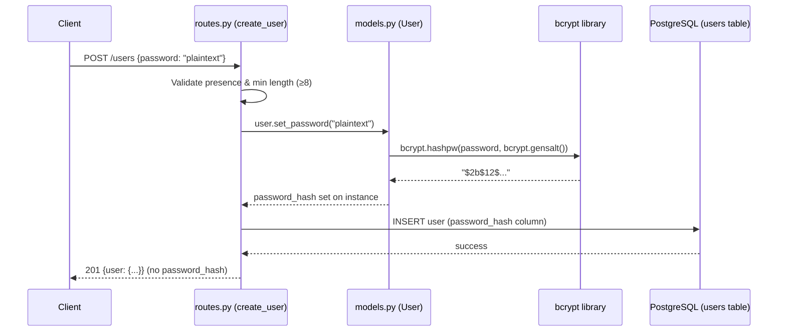

# Design Document: User Password Hashing

## Overview

This design replaces the current Werkzeug-based password hashing (scrypt/pbkdf2) with the `bcrypt` library in the RevoU Shop application. The change affects the `User` model's `set_password` and `check_password` methods, the `create_user` route's validation logic (minimum length from 6 → 8), and introduces the `bcrypt` package as a new dependency.

The scope is intentionally narrow: only the password hashing mechanism and validation rules change. The API contract (request/response shape), database schema, and existing login flow remain structurally the same — they just use bcrypt under the hood.

## Architecture



The architecture follows the existing layered pattern:
1. **Route layer** (`routes.py`): Input validation and HTTP response formatting
2. **Model layer** (`models.py`): Password hashing/verification logic encapsulated in `User` methods
3. **Library layer** (`bcrypt`): The actual cryptographic operations

No new modules or services are introduced. The change is confined to swapping the underlying hashing implementation and tightening validation.

## Components and Interfaces

### 1. Password Hasher (User model methods)

**File:** `models.py`

| Method | Input | Output | Description |
|--------|-------|--------|-------------|
| `set_password(raw_password: str)` | Plain-text password string | None (sets `self.password_hash`) | Hashes using `bcrypt.hashpw` with auto-generated salt |
| `check_password(raw_password: str)` | Plain-text password string | `bool` | Verifies using `bcrypt.checkpw` against stored hash |

**Implementation detail:**
- `bcrypt.gensalt()` generates a unique salt per call (default 12 rounds)
- `bcrypt.hashpw()` produces a `$2b$` prefixed hash string
- `bcrypt.checkpw()` handles salt extraction from the stored hash internally

### 2. Registration Endpoint Validation

**File:** `routes.py` — `create_user()` function

| Check | Condition | Response |
|-------|-----------|----------|
| Missing password | `"password"` key absent or falsy | 400 + error message |
| Empty password | `"password"` is empty string | 400 + error message |
| Too short | `len(password) < 8` | 400 + "Password must be at least 8 characters long" |
| Valid | `len(password) >= 8` | Proceed to hashing |

### 3. Dependency Addition

**File:** `requirements.txt`

Add `bcrypt==4.2.1` (or latest stable). Remove Werkzeug password utility imports from `models.py` (the Werkzeug package itself stays — Flask depends on it).

## Data Models

### Users Table (unchanged schema)

| Column | Type | Constraints | Notes |
|--------|------|-------------|-------|
| user_id | Integer | PK, auto-increment | |
| username | String(50) | NOT NULL, UNIQUE | |
| full_name | String(100) | NOT NULL | |
| role | String(20) | NOT NULL, default "Customer" | |
| email | String(255) | NOT NULL, UNIQUE | |
| password_hash | String(255) | NOT NULL | Now stores bcrypt `$2b$` hash instead of Werkzeug hash |
| is_active | Boolean | default True | |
| created_at | DateTime | NOT NULL, default utcnow | |

The `password_hash` column is already `String(255)` which accommodates bcrypt's 60-character output. No migration needed.

### Password Hash Format

A bcrypt hash stored in `password_hash` follows this structure:

```
$2b$12$XXXXXXXXXXXXXXXXXXXXXXXXXXXXXXXXXXXXXXXXXXXXXXXXXXXXXX
 │   │  └── 53 characters: 22-char salt + 31-char hash (base64)
 │   └── Cost factor (work factor rounds = 2^12 = 4096 iterations)
 └── Algorithm identifier (2b = bcrypt)
```

Total length: 60 characters. Always starts with `$2b$`.


## Correctness Properties

*A property is a characteristic or behavior that should hold true across all valid executions of a system — essentially, a formal statement about what the system should do. Properties serve as the bridge between human-readable specifications and machine-verifiable correctness guarantees.*

### Property 1: Password hash round-trip verification

*For any* valid plain-text password (8+ characters), hashing it with `set_password` and then verifying the same password with `check_password` against the stored hash SHALL return True.

**Validates: Requirements 4.1**

### Property 2: Unique salt per hash

*For any* valid plain-text password, hashing it twice with `set_password` SHALL produce two different hash strings (due to unique random salts generated each time).

**Validates: Requirements 2.2, 4.2**

### Property 3: Hash output is valid bcrypt format

*For any* valid plain-text password (8+ characters), the output of `set_password` SHALL be a string that starts with `$2b$` and is exactly 60 characters long (valid bcrypt hash format).

**Validates: Requirements 2.1, 2.3**

### Property 4: Password length validation boundary

*For any* string of length less than 8, the validation SHALL reject it (return 400). *For any* string of length 8 or more, the validation SHALL accept it for hashing.

**Validates: Requirements 3.1, 3.2**

### Property 5: Response never contains password hash

*For any* successful user registration, the response JSON SHALL NOT contain a `password_hash` key anywhere in the returned user data.

**Validates: Requirements 5.1**

## Error Handling

| Scenario | HTTP Status | Error Message | Handler |
|----------|-------------|---------------|---------|
| Missing `password` field | 400 | "Missing required field: username, full_name, email, password" | `create_user()` |
| Empty password (`""`) | 400 | "Missing required field: username, full_name, email, password" | `create_user()` (falsy check) |
| Password too short (< 8 chars) | 400 | "Password must be at least 8 characters long" | `create_user()` |
| Duplicate username/email | 409 | "Username or email already exists" | `create_user()` (IntegrityError) |
| bcrypt internal error | 500 | Generic error message | Exception handler |

**Design decisions:**
- Empty string and missing field share the same validation path (both are falsy in Python), matching the existing pattern.
- The bcrypt library raises `ValueError` for passwords exceeding 72 bytes (bcrypt's internal limit). We do NOT enforce a maximum length at the API level — bcrypt silently truncates, which is standard behavior. If a maximum is desired later, it can be added as a separate requirement.

## Testing Strategy

### Property-Based Tests (using Hypothesis)

The `hypothesis` library will be used for property-based testing in Python. Each property maps to a single test function with minimum 100 iterations.

| Test | Property | Generator Strategy |
|------|----------|-------------------|
| `test_hash_roundtrip` | Property 1 | `text(min_size=8, max_size=50, alphabet=printable)` |
| `test_unique_salts` | Property 2 | `text(min_size=8, max_size=50, alphabet=printable)` |
| `test_hash_format` | Property 3 | `text(min_size=8, max_size=50, alphabet=printable)` |
| `test_length_validation_boundary` | Property 4 | `text(min_size=1, max_size=7)` + `text(min_size=8, max_size=72)` |
| `test_response_excludes_hash` | Property 5 | `text(min_size=8, max_size=50, alphabet=printable)` (with Flask test client) |

**Configuration:**
- Each property test runs with `@settings(max_examples=100)`
- Tag format in comments: `# Feature: user-password-hashing, Property N: <description>`

### Unit Tests (using pytest)

| Test | Validates | Type |
|------|-----------|------|
| `test_register_missing_password` | Req 1.2 | Example |
| `test_register_empty_password` | Req 1.3 | Edge case |
| `test_register_success_returns_201` | Req 5.2 | Example |
| `test_register_stores_hash_in_db` | Req 2.4 | Integration |
| `test_check_password_method_exists` | Req 4.3 | Example |
| `test_wrong_password_fails_verification` | Req 4.1 (negative) | Example |

### Dependencies to Add

```
bcrypt==4.2.1
hypothesis==6.108.0
```

### Test Execution

```bash
pytest tests/ --run -v
```

Tests will be placed in `tests/test_password_hashing.py` (property tests) and `tests/test_registration.py` (unit/integration tests).
