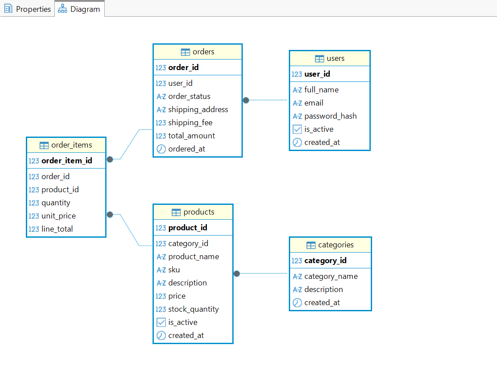
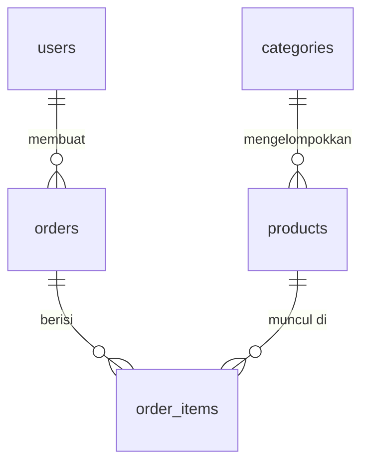

# RevoShop — Database (Checkpoint 1)

Skema relasional untuk **RevoShop**, sebuah toko online. Repositori ini berisi definisi
tabel PostgreSQL, data contoh, dan kumpulan query untuk entitas inti toko: `users`,
`categories`, `products`, `orders`, dan tabel penghubung `order_items`.

> **Catatan cakupan:** tabel `users` sengaja **belum memiliki kolom `role`**.
> Kolom tersebut akan ditambahkan sebagai schema migration di Checkpoint 2.

---

## Daftar isi

- [RevoShop — Database (Checkpoint 1)](#revoshop--database-checkpoint-1)
  - [Daftar isi](#daftar-isi)
  - [Struktur proyek](#struktur-proyek)
  - [Diagram relasi (ERD)](#diagram-relasi-erd)
  - [Ringkasan skema](#ringkasan-skema)
  - [1. Prasyarat](#1-prasyarat)
  - [2. Instalasi PostgreSQL \& password postgres](#2-instalasi-postgresql--password-postgres)
  - [3. Verifikasi instalasi](#3-verifikasi-instalasi)
  - [4. Membuat database revoshop\_db](#4-membuat-database-revoshop_db)
  - [5. Menjalankan Schema.sql dan Seed.sql](#5-menjalankan-schemasql-dan-seedsql)
  - [6. Verifikasi data](#6-verifikasi-data)
  - [7. Menjalankan Queries.sql](#7-menjalankan-queriessql)
  - [Reset database](#reset-database)
  - [Keputusan desain](#keputusan-desain)

---

## Struktur proyek

```
revoshop-db/
├── README.md
├── .gitignore
├── Schema.sql      # definisi tabel, constraint, foreign key
├── Seed.sql        # data contoh: 8 user, 23 produk, 12 order, 30 line item
├── Queries.sql     # query demonstrasi, termasuk WHERE + ORDER BY + LIMIT
└── docs/
    └── erd.png     # diagram relasi antar tabel
```

## Diagram relasi (ERD)





`orders` dan `products` berelasi **many-to-many**: satu order bisa berisi banyak produk,
dan satu produk bisa muncul di banyak order. Relasi itu diselesaikan oleh `order_items`,
yang menyimpan `order_id` dan `product_id` sebagai foreign key beserta jumlah dan harga
satuan saat transaksi terjadi.

## Ringkasan skema

| Tabel         | Primary key     | Foreign key                                        | Fungsi                                |
| ------------- | --------------- | -------------------------------------------------- | ------------------------------------- |
| `users`       | `user_id`       | —                                                   | Akun pelanggan                        |
| `categories`  | `category_id`   | —                                                   | Kategori produk                       |
| `products`    | `product_id`    | `category_id` → `categories`                        | Barang yang dijual                    |
| `orders`      | `order_id`      | `user_id` → `users`                                 | Pesanan yang dibuat pengguna          |
| `order_items` | `order_item_id` | `order_id` → `orders`, `product_id` → `products`    | Tabel penghubung: rincian tiap pesanan |

Konvensi penamaan: `snake_case` di seluruh skema, nama tabel dalam bentuk jamak, primary
key bernama `<nama_tabel_tunggal>_id`, foreign key memakai nama kolom yang dirujuk, kolom
waktu berakhiran `_at`, dan nilai uang disimpan sebagai `numeric(12,2)` — bukan tipe
floating point. Seluruh harga dalam Rupiah.

Nilai `order_status` yang diizinkan: `Pending`, `Paid`, `Shipped`, `Delivered`,
`Cancelled`, `Return Process`. Dibatasi oleh constraint `chk_orders_status`.

---

## 1. Prasyarat

* PostgreSQL **14 atau lebih baru** (diuji pada PostgreSQL 16)
* DBeaver (atau pgAdmin 4)
* Git
* PowerShell — sudah tersedia bawaan di Windows

## 2. Instalasi PostgreSQL & password postgres

Unduh installer dari <https://www.postgresql.org/download/windows/>, jalankan, dan biarkan
pengaturan default (port `5432`). Pastikan komponen **Command Line Tools** ikut tercentang.

Saat instalasi, kamu akan diminta membuat **password untuk superuser `postgres`**. Catat
password ini — semua langkah berikutnya membutuhkannya.

Jika `psql` belum dikenali di PowerShell, tambahkan foldernya ke PATH:

```powershell
$env:Path += ";C:\Program Files\PostgreSQL\16\bin"
```

Perintah di atas hanya berlaku untuk sesi PowerShell yang sedang terbuka. Untuk permanen,
tambahkan lewat **Settings → System → About → Advanced system settings → Environment
Variables**.

## 3. Verifikasi instalasi

```powershell
psql --version
# psql (PostgreSQL) 16.x

psql -U postgres -h localhost -c "SELECT version();"
```

Perintah kedua akan meminta password `postgres`. Jika versi PostgreSQL tampil, berarti
server sudah berjalan dan kredensialmu benar.

## 4. Membuat database revoshop_db

**Lewat DBeaver**

1. Buka DBeaver → **Database → New Database Connection → PostgreSQL**.
2. Isi Host `localhost`, Port `5432`, Database `postgres`, Username `postgres`, lalu
   masukkan password. Klik **Test Connection**, kemudian **Finish**.
3. Pada panel Database Navigator, klik kanan koneksi **postgres → Create → Database**.
4. Isi nama `revoshop_db`, klik **OK**.
5. Klik kanan koneksi → **Refresh** (F5). Pastikan `revoshop_db` muncul di daftar database.

**Lewat PowerShell**

```powershell
createdb -U postgres revoshop_db
```

## 5. Menjalankan Schema.sql dan Seed.sql

Clone repositori terlebih dahulu:

```powershell
git clone https://github.com/<username-kamu>/revoshop-db.git
cd revoshop-db
```

**Opsi A — PowerShell**

```powershell
psql -U postgres -d revoshop_db -f Schema.sql
psql -U postgres -d revoshop_db -f Seed.sql
```

**Opsi B — DBeaver**

1. Klik `revoshop_db` di Database Navigator agar menjadi database aktif.
2. **File → Open File**, pilih `Schema.sql`.
3. Jalankan seluruh isi file dengan **Execute script** (`Alt+X`) — bukan `Ctrl+Enter`,
   karena `Ctrl+Enter` hanya menjalankan satu perintah tempat kursor berada.
4. Ulangi langkah 2–3 untuk `Seed.sql`.
5. Klik kanan `revoshop_db` → **Refresh** (F5) untuk melihat kelima tabel.

Urutannya tidak boleh dibalik: `Seed.sql` membutuhkan tabel yang dibuat `Schema.sql`.

Saat menjalankan `Seed.sql`, DBeaver akan menampilkan peringatan
*"Execute dangerous queries"* karena ada perintah `UPDATE` tanpa `WHERE`. Perintah itu
memang disengaja — klik **OK**.

## 6. Verifikasi data

```sql
SELECT 'users' AS tabel, COUNT(*) AS jumlah FROM users
UNION ALL SELECT 'categories',  COUNT(*) FROM categories
UNION ALL SELECT 'products',    COUNT(*) FROM products
UNION ALL SELECT 'orders',      COUNT(*) FROM orders
UNION ALL SELECT 'order_items', COUNT(*) FROM order_items;
```

Hasil yang diharapkan: 8 users, 6 categories, 23 products, 12 orders, 30 order_items.

Untuk memastikan foreign key terpasang benar:

```sql
SELECT tc.table_name, kcu.column_name, ccu.table_name AS mereferensi
FROM information_schema.table_constraints tc
JOIN information_schema.key_column_usage kcu
     ON tc.constraint_name = kcu.constraint_name
JOIN information_schema.constraint_column_usage ccu
     ON tc.constraint_name = ccu.constraint_name
WHERE tc.constraint_type = 'FOREIGN KEY'
ORDER BY 1, 2;
```

Harus muncul empat baris: `products.category_id → categories`, `orders.user_id → users`,
`order_items.order_id → orders`, dan `order_items.product_id → products`.

Terakhir, pastikan `total_amount` setiap order sama dengan jumlah line item-nya. Query
berikut harus mengembalikan **0 baris**:

```sql
SELECT o.order_id, o.total_amount,
       o.shipping_fee + COALESCE(SUM(oi.line_total), 0) AS hasil_hitung
FROM orders o
LEFT JOIN order_items oi ON oi.order_id = o.order_id
GROUP BY o.order_id, o.total_amount, o.shipping_fee
HAVING o.total_amount <> o.shipping_fee + COALESCE(SUM(oi.line_total), 0);
```

## 7. Menjalankan Queries.sql

```powershell
psql -U postgres -d revoshop_db -f Queries.sql
```

Di DBeaver, buka `Queries.sql` lalu jalankan per query dengan `Ctrl+Enter` agar hasil tiap
query terlihat terpisah.

Query pertama adalah kombinasi wajib `WHERE` + `ORDER BY` + `LIMIT` — produk Electronics
termahal yang stoknya masih ada:

```sql
select p.product_id, p.product_name, p.sku, p.price, p.stock_quantity
from products p
where p.category_id = 1
  and p.is_active = true
  and p.stock_quantity > 0
order by p.price desc
limit 5;
```

Ketiga klausa bekerja berurutan dan urutan penulisannya tidak bisa ditukar: `WHERE`
menyaring baris terlebih dahulu, `ORDER BY` mengurutkan baris yang lolos filter, lalu
`LIMIT` mengambil sejumlah baris teratas dari hasil pengurutan itu.

Query lainnya mencakup join antar tabel melalui tabel penghubung, daftar produk beserta
kategorinya, rincian isi pesanan, dan produk terlaris.

## Reset database

```powershell
psql -U postgres -d revoshop_db -f Schema.sql   # hapus dan buat ulang semua tabel
psql -U postgres -d revoshop_db -f Seed.sql     # muat ulang data contoh
```

`Schema.sql` diawali perintah `DROP TABLE IF EXISTS ... CASCADE`, sehingga aman dijalankan
berulang kali. Namun `Seed.sql` **harus dijalankan setelah `Schema.sql`** — menjalankan
`Seed.sql` dua kali tanpa reset akan gagal dengan error
`duplicate key value violates unique constraint`, karena `email`, `category_name`, dan
`sku` bersifat unik.

Untuk menghapus seluruh database:

```powershell
dropdb -U postgres revoshop_db
```

---

## Keputusan desain

* **`numeric(12,2)` untuk nilai uang.** Tipe `float` menyimpan angka secara biner sehingga
  menimbulkan galat pembulatan yang tidak dapat ditoleransi untuk transaksi.
* **`order_items.unit_price` disimpan, bukan diambil dari `products`.** Harga bisa berubah
  sewaktu-waktu, sedangkan sebuah pesanan harus menyimpan harga yang benar-benar dibayar
  pelanggan. Contohnya order #1 membeli Keychron K2 seharga 1.199.000 (harga promo),
  padahal harga sekarang 1.299.000.
* **`line_total` diisi lewat `UPDATE` di `Seed.sql`** (`quantity * unit_price`), lalu
  `total_amount` dihitung dari akumulasi `line_total` ditambah `shipping_fee`. Dengan cara
  ini tidak ada angka total yang perlu diketik manual.
* **Pilihan `ON DELETE` dibuat berbeda per relasi.** `order_items` memakai `CASCADE` dari
  `orders`, karena rincian pesanan tidak bermakna tanpa pesanannya. Sebaliknya `users`,
  `products`, dan `categories` memakai `RESTRICT` agar riwayat transaksi tidak ikut
  terhapus.
* **Constraint `CHECK`** menjaga harga dan stok tidak negatif, jumlah pembelian minimal 1,
  serta membatasi `order_status` pada enam nilai yang valid.
* **Penamaan disiapkan untuk SQLAlchemy.** Kolom `snake_case` dan primary key
  `<tabel>_id` akan langsung memetakan ke model ORM pada Checkpoint 2.
